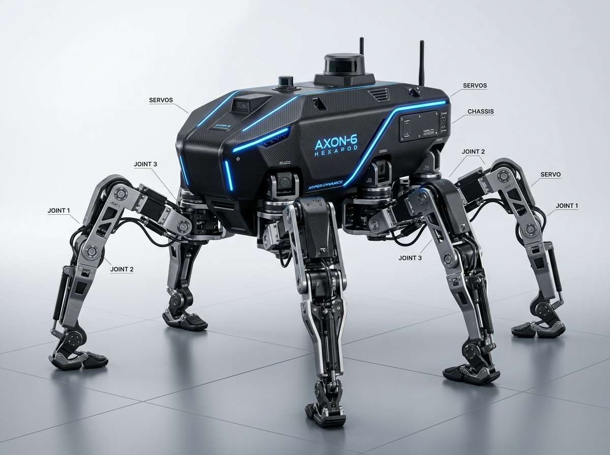
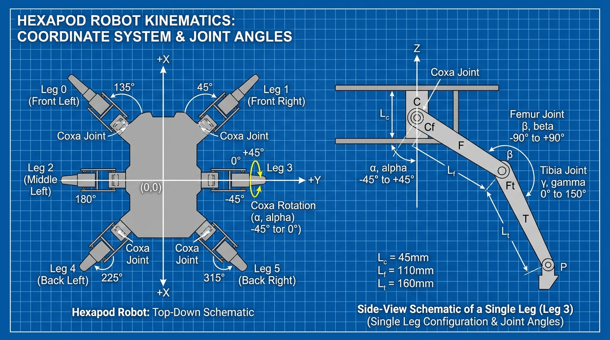
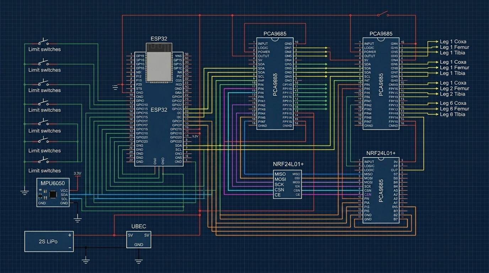

# ESP32 Hexapod Robot Controller



This repository contains the firmware for an 18-DOF (Degree of Freedom) hexapod walking robot powered by the ESP32. It handles inverse kinematics, leg coordination, balance leveling, and multiple remote control interfaces in real-time.

There are two versions of this project available in this repository:
- **`main` branch** (This branch): The optimized classic Arduino version using a modular `.ino` structure.
- **`feature/freertos-native-architecture` branch**: A native FreeRTOS version structured into clean C++ header and source files (`.h`/`.cpp`) using advanced RTOS queues and event groups.

---

## Features

- **Real-Time Inverse Kinematics (IK)**: Smooth analytical leg angle calculation running at 50Hz.
- **Davenport Auto-Leveling**: Dynamic body leveling using an MPU6050 IMU and PID correction.
- **Smooth Gait Generation**: Support for Tripod, Ripple, and Wave gaits using cycloid trajectories.
- **Multiple Control Interfaces**: Control the robot using a Web App (WebSockets), BLE, or an NRF24L01+ physical remote.
- **Wireless Updates (OTA)**: Upload firmware upgrades wirelessly over WiFi.
- **Safety Watchdog**: Built-in hardware watchdog timer (TWDT) and battery protection to shut down servos if power gets too low.

---

## Kinematics & Coordinate System

Below is the layout of the leg coordinates, joint angles ($\alpha, \beta, \gamma$), and leg numbering configurations:



---

## Hardware Connection Diagram

Below is the wiring schematic showing the connection between the ESP32, PCA9685 servo drivers, MPU6050 sensor, and wireless modules:



---

## Project Structure

On this branch, the files inside the `Hexapod Code` folder use standard modular `.ino` structure:
- `hexapod_esp32_v3.ino`: Main setup, loop, global variables, and task registration.
- `hexapod_tasks.ino`: Core 0 (sensors/comm) and Core 1 (kinematics) task loops.
- `hexapod_drivers.ino`: PCA9685 I2C driver utilizing auto-increment write optimizations.
- `hexapod_ik.ino` & `hexapod_gait.ino`: Kinematics equations, cycloid step generation, and gait plans.
- `hexapod_wifi.ino` & `hexapod_comm.ino`: WiFi connection, WebSockets handling, BLE, and NRF24 receiver.
- `hexapod_config.ino`: Settings loading/saving from NVS protected by CRC32 check.
- `hexapod_battery.ino` & `hexapod_watchdog.ino`: Power tracking and TWDT system safety.
- `hexapod_telemetry.ino`: Real-time fast/slow telemetry serialization.

---

## Getting Started

### Prerequisites
To compile the code, you will need the following libraries installed in your Arduino IDE:
- **ArduinoJson** (by Benoit Blanchon)
- **WebSockets** (by Markus Sattler)
- **RF24** (by TMRh20 - optional, for physical remote control)

### Uploading the Code
1. Open `hexapod_esp32_v3.ino` inside the `Hexapod Code` folder in Arduino IDE.
2. Under **Tools**, configure the ESP32 partition scheme to **Minimal SPIFFS (1.9MB APP)**.
3. Select your ESP32 Dev Module port.
4. Click **Upload**.

### Controlling the Robot
- On startup, the robot creates a WiFi Access Point named `Hexapod-Setup` (password: `12345678`).
- Connect to it and open your WebSocket client (or custom controller) at `ws://192.168.4.1:81`.
- Send walking commands as JSON packets:
  ```json
  {
    "cmd": "motion",
    "x": 50,
    "y": 0,
    "yaw": 10
  }
  ```

---

## License
Licensed under the MIT License. See [LICENSE](LICENSE) for details.

Developed & maintained by **Ali Eren Safi**.
